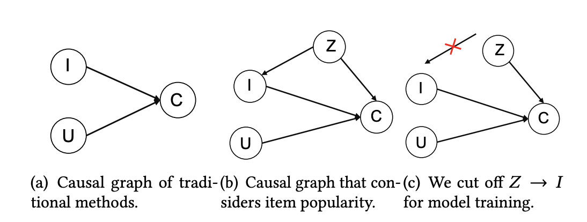

# Causal Inference in Recommender System: Manipulating Popularity Bias
The widespread use of recommender systems across various platforms has introduced a pervasive challenge - **popularity bias**. This bias overshadows personalized selections and limits the diversity of recommendation systems, as they tend to prioritize widely popular items, hindering the discovery of unpopular content that may better align with individual user preferences. 

## Introduction
Popularity bias serves as a confounding factor in item and user interactions. Traditional algorithms often lean towards promoting popular items for profit, or overlook the significance of popularity, resulting in an imbalanced promotion of trending items. As a result, the content recommended to users often reflects prevailing trends more than their interests. This biased prioritization fosters a self-reinforcing loop, where popular items continue to be promoted.

To address popularity bias, we use the causal inference approach to de-bias user history data. We implemented two models, the Popularity-bias De-confounding and Adjusted model ([PDA](https://arxiv.org/pdf/2105.06067.pdf)), and the Disentangling Interest and Conformity with causal Embeddings model ([DICE](https://arxiv.org/pdf/2006.11011.pdf)) to produce more personalized recommendations. The two models introduce different logic behind manipulating the popularity bias, and we will discuss the details in the Methodology section.

We found that **instead of completely removing the popularity bias, incorporating the bias in the algorithms performs better results, ie. achieving higher recall rates**. 

## Conventional Recommender Systems
Recommender Systems are widely utilized in various online platforms such as personalized shopping recommendations, streaming platforms, and social media advertisements. These platforms employ the systems to match users to their potential preferences. Existing recommendation systems are divided into two categories, collaborative filtering(CF) and content-based recommendation(CTR). CF extracts the user preference based on users’ historical behaviors in which algorithms conduct similarities between users and items from historical interactions. CTR prediction takes advantage of high-order features of users, items, or context, to feed into neural networks. These traditional popular systems, although they involve high-level deep learning techniques, focus on correlations in data rather than causality, which is not induced by the former.

Here, our project borrowed ideas from ZHANG and ZHENG’s papers to integrate causal inference into recommendation systems, which enhance the accuracy and interpretability of personalized suggestions. These two proposed models, rooted in causal reasoning, provide a valuable framework for other recommender algorithms. 

## Causal Inference 
Let's take a look at the popularity bias under causal relationships.

In Figure 1(a), the traditional recommendation methods take user information (U node) and item information (I node) to account for the interaction, namely click (C node). This relationship form, **I -> C** and **U -> C**, is called the *collider effect*, that U and I are independent of each other, but both contribute to C.

However, in reality, a third factor, popularity (Z node) affects the interaction (C node) and the item information (I node). This Z variable is called a *confounder*, shown in Figure 1(b). To be specific, people have a conformity mentality that tends to follow the majority to choose purchase (**Z -> C**). So the more popular the items are, the more likely people will interact with them. On the other hand, recommender models tend to inherit the bias in the data to expose popular items more frequently (**Z -> I -> C**), which further exacerbates the popularity bias. The popularity (Z) that existed in the second path is a bias amplification and we want to remove or control the strength of it. 

<em>Causal Relationship Between Popularity and User Click</em>

## Data Processing

## Methodology
### PDA
new page

### DICE
new page

## Result
new page

## Application & Concern

## Reference
- [Zhang, Yang, Fuli Feng, Xiangnan He, Tianxin Wei, Chonggang Song, Guohui Ling, and Yongdong Zhang.2021. “Causal intervention for leveraging popularity bias in recommendation.” In Proceedings of the 44th International ACM SIGIR Conference on Research and Development in Information Retrieval.](https://arxiv.org/pdf/2105.06067.pdf)
 								
- [Yu Zheng, Chen Gao, Xiang Li, Xiangnan He, Depeng Jin, Yong Li. 2021. Disentangling User Interest and Conformity for Recommendation with Causal Embedding. In Proceedings of the Web Conference 2021.](https://arxiv.org/pdf/2006.11011.pdf)
